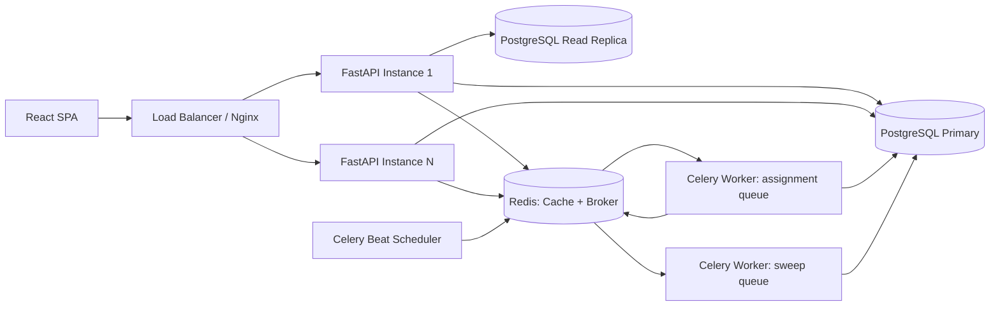
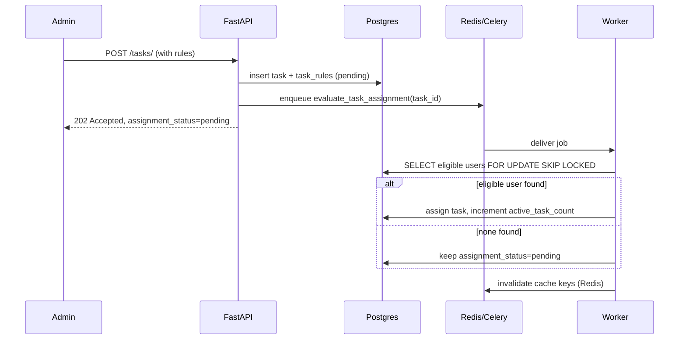

# Architecture: Task Management System with Dynamic Rule-Based Task Assignment

> For the full shareable technical document (API reference, scenario tables, worked caching
> examples, scaling guide, FAQ), see **[TECHNICAL_DOCUMENTATION.md](TECHNICAL_DOCUMENTATION.md)**.

## Objective

Design for a scalable Task Management System where tasks are not manually assigned to users but are matched automatically against dynamic, per-task eligibility rules. Sized for **100k users**, **1M tasks**, with APIs required to respond in **under 200ms**.

## Tech Stack

| Concern | Choice |
|---|---|
| Backend | Python, FastAPI (async) |
| Database | PostgreSQL |
| Caching & Broker | Redis |
| Background Processing | Celery + Celery Beat |
| Auth | JWT (access) + rotating refresh tokens |
| Frontend | React |
| Infra | Docker & Docker Compose |

## Key Design Decisions (summary)

- **Tie-break rule (multiple eligible users)**: assign to the **least-loaded** eligible user — lowest `active_task_count` — tie-broken by **least-recently-assigned** (`last_assigned_at` ascending; `NULL` = never assigned, highest priority).
- **Lock once started**: tasks in `in_progress` or `done` stay with their current assignee even if user attributes or rules change later.
- **No eligible users**: this is a normal, expected state, not an error. The task is persisted with `assignment_status = PENDING` and is automatically re-evaluated whenever relevant data changes, backed by a periodic sweep as a safety net.
- **Rules are structured, not free-form**: rules operate over a fixed, known attribute set (department, experience, location, active task count), which allows the rule engine to compile directly into indexed SQL predicates instead of a generic condition interpreter. This is the single decision that makes the "highly optimised" requirements achievable at 100k/1M scale.
- **Recompute is event-driven and bounded**, never a full-table scan — triggered by the specific mutation (task created, rule changed, user changed) and scoped to the minimal set of affected rows via indexes.

---

## 1. High-Level System Architecture



**Component responsibilities**

- **FastAPI instances** are stateless and horizontally scaled behind a load balancer. All request handlers are async, using an async SQLAlchemy engine (`asyncpg` driver) so a single process can serve many concurrent I/O-bound requests without blocking.
- **PostgreSQL primary** takes all writes and the transactional assignment logic (row locking). A **read replica** serves read-heavy, less time-critical GET traffic to keep the primary's connection pool free for writes and assignment transactions.
- **Redis** serves two logical roles behind one deployment: response/query cache (see [Section 5](#5-caching-strategy)) and the Celery broker/result backend. These use separate key prefixes / Redis logical DBs to avoid collisions.
- **Celery workers** run on two separate queues:
  - `assignment` — low-latency queue for real-time triggers: task created, rule changed, user attribute changed.
  - `sweep` — low-priority queue for the periodic safety-net job, so a large batch sweep never delays a user-facing assignment.
- **Celery Beat** schedules the periodic `sweep_pending_tasks` job.
- Application code follows a layered structure — **routers → services → repositories → models** — keeping the rule engine and assignment logic independently testable and decoupled from both the HTTP layer and the Celery task wrappers.

---

## 2. Database Schema & Indexing Strategy

### Core tables

```
users
  id                  BIGSERIAL PK
  email               TEXT UNIQUE NOT NULL
  password_hash       TEXT NOT NULL
  role                ENUM('admin','manager','user') NOT NULL
  department          ENUM('finance','hr','it','operations') NOT NULL
  experience_years    SMALLINT NOT NULL
  location            TEXT NOT NULL
  active_task_count   INTEGER NOT NULL DEFAULT 0
  last_assigned_at    TIMESTAMPTZ NULL
  is_active           BOOLEAN NOT NULL DEFAULT true
  created_at          TIMESTAMPTZ NOT NULL DEFAULT now()
  updated_at          TIMESTAMPTZ NOT NULL DEFAULT now()

tasks
  id                  BIGSERIAL PK
  title               TEXT NOT NULL
  description         TEXT
  status              ENUM('todo','in_progress','done') NOT NULL DEFAULT 'todo'
  priority            ENUM('low','medium','high') NOT NULL
  due_date            DATE
  created_by          BIGINT REFERENCES users(id)
  assigned_to         BIGINT REFERENCES users(id) NULL
  assignment_status   ENUM('pending','assigned','unassignable') NOT NULL DEFAULT 'pending'
  created_at          TIMESTAMPTZ NOT NULL DEFAULT now()
  updated_at          TIMESTAMPTZ NOT NULL DEFAULT now()

task_rules                                  -- 1:1 with tasks
  task_id             BIGINT PK REFERENCES tasks(id) ON DELETE CASCADE
  department          ENUM('finance','hr','it','operations') NULL   -- NULL = unconstrained
  min_experience_years SMALLINT NULL
  location            TEXT NULL
  max_active_tasks    INTEGER NULL

refresh_tokens
  id                  BIGSERIAL PK
  user_id             BIGINT REFERENCES users(id)
  token_hash          TEXT NOT NULL
  expires_at          TIMESTAMPTZ NOT NULL
  revoked_at          TIMESTAMPTZ NULL
```

`task_rules` is deliberately modeled as structured, nullable columns rather than a generic EAV/JSONB table. The pre-work fixes the attribute set (department, experience, location, active task count), so there's no need for arbitrary rule flexibility — and structured columns are what make composite/partial indexing (below) possible. A JSONB blob would force a re-scan or a GIN index that can't efficiently support the `ORDER BY active_task_count` tie-break.

### Indexes and why each exists

| Index | Purpose |
|---|---|
| `users(department, experience_years, active_task_count, last_assigned_at) WHERE is_active` | The core rule-engine query — filters on department/experience, sorts by load then least-recently-assigned — is satisfied by a single index scan, avoiding a sequential scan over 100k users per assignment. |
| `users(email)` UNIQUE | Login lookups. |
| `tasks(assigned_to, status)` | Powers `GET /my-eligible-tasks`, which is just "this user's assigned tasks" — an index-only scan instead of a table scan over 1M tasks. |
| `tasks(assignment_status) WHERE assignment_status = 'pending'` (partial) + `task_rules(department, min_experience_years)` | Together power the reverse lookup used during recompute: "which pending tasks might this just-changed user now match?" Postgres partial index predicates can only reference columns of the table being indexed, so this is implemented as a partial index on `tasks.assignment_status` (cheaply narrowing to the small pending subset) joined to `task_rules` on its primary key (`task_id`) — a fast PK lookup, not a table scan. |
| `tasks(due_date)`, `tasks(priority)`, `tasks(created_by)` | Standard listing/filtering/sorting for task list views. |
| `tasks(assignment_status)` (partial, `= 'pending'`) | Backs the periodic sweep job's scan set. |

At 100k users, a plain B-tree is sufficient (no need for BRIN/hash indexes). At 1M tasks, partial indexes on `assignment_status = 'pending'` are the key lever that keeps recompute operations cheap regardless of how large the `assigned`/`done` history grows. If task volume grows well beyond 1M with heavy historical data, range-partitioning `tasks` by `created_at` or `status` is a natural next step, called out here as a scalability option rather than a day-one requirement.

---

## 3. Dynamic Rule-Based Assignment Engine

### Evaluation query

Executed inside a single transaction by a `RuleEngineService`, decoupled from both the Celery task wrapper and the FastAPI route so it can be unit tested in isolation:

```sql
SELECT id, active_task_count
FROM users
WHERE is_active = true
  AND (department = :dept OR :dept IS NULL)
  AND (experience_years >= :min_exp OR :min_exp IS NULL)
  AND (location = :loc OR :loc IS NULL)
  AND (active_task_count < :max_active OR :max_active IS NULL)
ORDER BY active_task_count ASC, last_assigned_at ASC NULLS FIRST, id ASC
LIMIT 1
FOR UPDATE SKIP LOCKED;
```

- **Multiple eligible users** → the query already resolves this deterministically: pick the least-loaded candidate (`active_task_count ASC`), tie-broken by least-recently-assigned (`last_assigned_at ASC NULLS FIRST`, then `id ASC`). Users who have never been assigned (`last_assigned_at IS NULL`) are preferred among equally loaded candidates.
- **In-progress / done tasks** → once a task moves to `in_progress` or `done`, it is **locked** to the current assignee. User profile changes and rule edits do not trigger reassignment for locked tasks (enterprise "lock once started" policy).
- **Concurrency safety** → `FOR UPDATE SKIP LOCKED` locks the selected candidate row for the duration of the transaction. If two Celery workers evaluate two different tasks with overlapping eligible pools at the same time, the second worker skips any row already locked by the first and moves to the next-best candidate, rather than blocking or double-assigning. The assignment (`tasks.assigned_to`, `tasks.assignment_status`) and the counter increment (`users.active_task_count += 1`) happen in the same transaction as the lock, so a crash mid-assignment can't leave the counter and the assignment out of sync.
- **No eligible users** → the query returns zero rows. This is not an error path: `tasks.assignment_status` is set to (or remains) `pending`, `assigned_to` stays `NULL`. The task is picked up automatically the next time a relevant user changes (Section 4) or by the periodic sweep. If a task remains `pending` past a configurable threshold (e.g. 24h), it is surfaced on an admin "needs attention" view — this is a monitoring/UX concern, not a change to the assignment semantics.

### Assignment flow



Task creation is deliberately asynchronous end-to-end: the API returns `202 Accepted` immediately after persisting the task and its rules, and the actual matching happens in the background worker. This keeps `POST /tasks/` fast and avoids coupling API latency to rule-engine query cost.

---

## 4. Recompute Strategy (Stories 3 & 4)

Recompute is **event-driven and scoped**, never a full 1M-row recompute, which is what keeps it viable at scale:

- **Rule changed / task resubmitted (Story 4)**: enqueue `recompute_for_task_rule_change(task_id)` for that single task (Admin/Manager edit via UI or API). Same assignment code path — cheap and index-driven since it only touches one task.
- **User attribute changed (Story 3)**: enqueue `recompute_for_user_change(user_id)`, which performs two bounded lookups instead of touching all tasks:
  1. **Forward check** — if the user is currently `assigned_to` some `assigned` tasks whose rules they no longer satisfy (e.g. they moved departments), those tasks are flipped back to `pending` and re-queued for assignment.
  2. **Reverse check** — using the partial index on `tasks.assignment_status = 'pending'` joined to `task_rules` by primary key, find pending tasks whose rules now match the user's new attributes, and attempt assignment for each. Since `pending` tasks are a small subset of the total, this lookup stays fast regardless of overall task volume.
- **Safety-net sweep**: Celery Beat runs `sweep_pending_tasks` every 5–10 minutes, iterating only over `pending` tasks (bounded, small set via the partial index) to catch edge cases the event-driven paths might miss — e.g. a brand-new user signing up who happens to unlock a long-pending task.
- **Task completion**: when a task moves to `done`, the assigned user's `active_task_count` is decremented, freeing capacity for *future* assignments (not retroactive to already-decided tasks).

This design directly avoids the trap of "user changes → recompute everything": both recompute paths are indexed lookups bounded by either "this one user's assigned tasks" or "the pending subset," which stays small relative to the full 1M-task table even at scale.

---

## 5. Caching Strategy

Cache-aside pattern throughout, backed by Redis:

- **`GET /my-eligible-tasks`**: cache key `my_tasks:{user_id}:{cursor}`, cursor-based (not offset) pagination to stay performant deep into a user's task list. Short TTL (~30–60s) plus explicit invalidation — the key is deleted whenever that user's assignment or task status changes (write-through invalidation from the assignment worker and the task-status-update endpoint). On a cache miss, it falls back to the `tasks(assigned_to, status)` index, which is fast enough on its own that the cache is primarily there to absorb repeated polling from the frontend.
- **`GET /tasks/{id}/eligible-users`**: treated as an admin/preview endpoint, bounded with `LIMIT` (e.g. top 20 candidates by `active_task_count`) rather than returning an unbounded list. Cached as `eligible_preview:{task_id}:{rules_version}`, where `rules_version` is an integer incremented every time that task's rules are edited — this makes the cache self-invalidating on rule changes without needing an explicit delete call, plus a short TTL as a backstop.
- Redis is shared with Celery, but cache keys and broker/result-backend keys live under separate prefixes (or separate logical Redis DBs) to avoid any collision or accidental eviction of in-flight job state.

---

## 6. API Design

| Endpoint | Notes |
|---|---|
| `POST /tasks/` | Admin/Manager only. Inserts `tasks` + `task_rules` atomically, enqueues `evaluate_task_assignment(task_id)` on the `assignment` queue, returns `202 Accepted` with `assignment_status = pending`. |
| `GET /tasks/{id}/eligible-users` | Cached (`eligible_preview:{task_id}:{rules_version}`), capped result size, backed by the `users(department, experience_years, active_task_count)` index. |
| `GET /my-eligible-tasks` | Cursor-paginated, cache-first (`my_tasks:{user_id}:{cursor}`), backed by `tasks(assigned_to, status)`. |
| `POST /tasks/recompute-eligibility` | Accepts `task_id` or `user_id`; enqueues the same underlying Celery tasks used by the automatic triggers, so it's a manual/idempotent re-run rather than a separate code path. |
| `PATCH /users/{id}` *(supporting)* | Profile update (department/experience/location) → triggers `recompute_for_user_change` on commit. |
| `PATCH /tasks/{id}` *(supporting)* | Admin/Manager **Edit / resubmit** updates title/description/priority/due_date/rules and always enqueues `recompute_for_task_rule_change` (**done tasks are rejected with 409**); User may only advance status (`todo → in_progress → done`). Status → `done` adjusts `active_task_count`. |

---

## 7. Authentication & Authorization

- **JWT access tokens**, short-lived (~15 minutes), stateless verification on every request.
- **Refresh tokens**, longer-lived, stored hashed in `refresh_tokens`, rotated on every use (old token revoked, new one issued) to limit the blast radius of a leaked refresh token.
- **Roles**: `admin` (manage users, create/edit tasks and rules, view all data), `manager` (create tasks), `user` (view only their own assigned tasks via `/my-eligible-tasks`). Enforced via FastAPI dependency injection on each route, not scattered ad-hoc checks.

---

## 8. Scalability & Performance (100k users / 1M tasks / <200ms)

- **Async I/O**: FastAPI + `asyncpg`/async SQLAlchemy so each process handles many concurrent requests without blocking on DB/Redis round-trips; PgBouncer in front of Postgres for connection pooling once instance count grows.
- **Read/write split**: GET-heavy, less time-critical traffic reads from a replica; the primary is reserved for writes and the assignment transaction (which needs row-level locking guarantees).
- **Queue separation**: `assignment` vs `sweep` Celery queues ensure the periodic bulk safety-net job never delays real-time, user-facing assignment latency.
- **Partial indexes on `pending` state**: the two most scale-sensitive operations (recompute reverse-lookup, sweep) are bounded by the `pending` subset via partial indexes, so their cost doesn't grow proportionally with total task volume.
- **Independent horizontal scaling**: FastAPI pods and Celery workers scale independently of each other based on their respective load profiles (API request rate vs. assignment/recompute job volume).
- **Bounded responses**: both `/my-eligible-tasks` (cursor pagination) and `/tasks/{id}/eligible-users` (capped `LIMIT`) avoid unbounded payloads that would blow the 200ms budget at scale.
- **Operational visibility** (recommended, not core requirement): structured logging and basic metrics — assignment latency, queue depth, cache hit rate — to catch regressions before they show up as user-facing latency.
