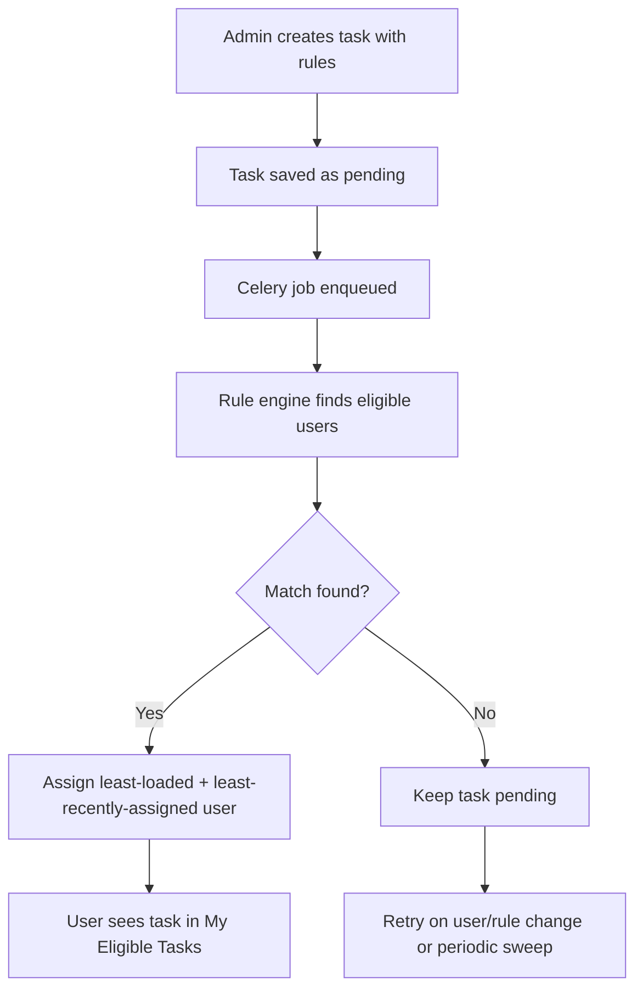
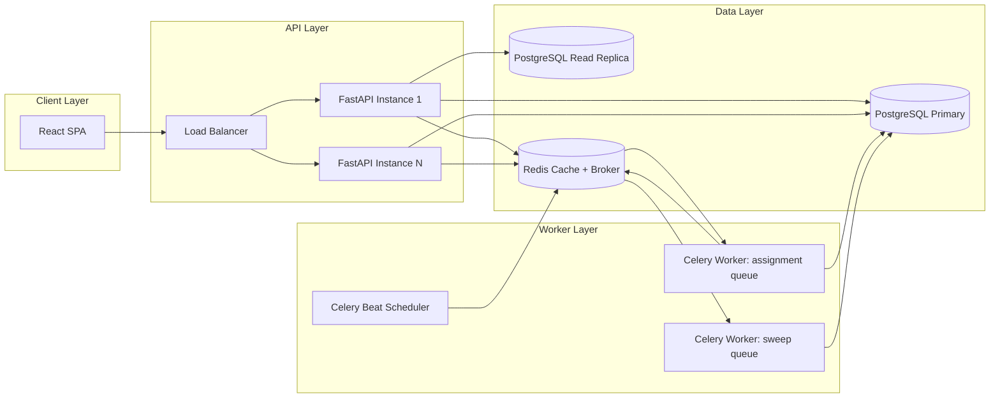
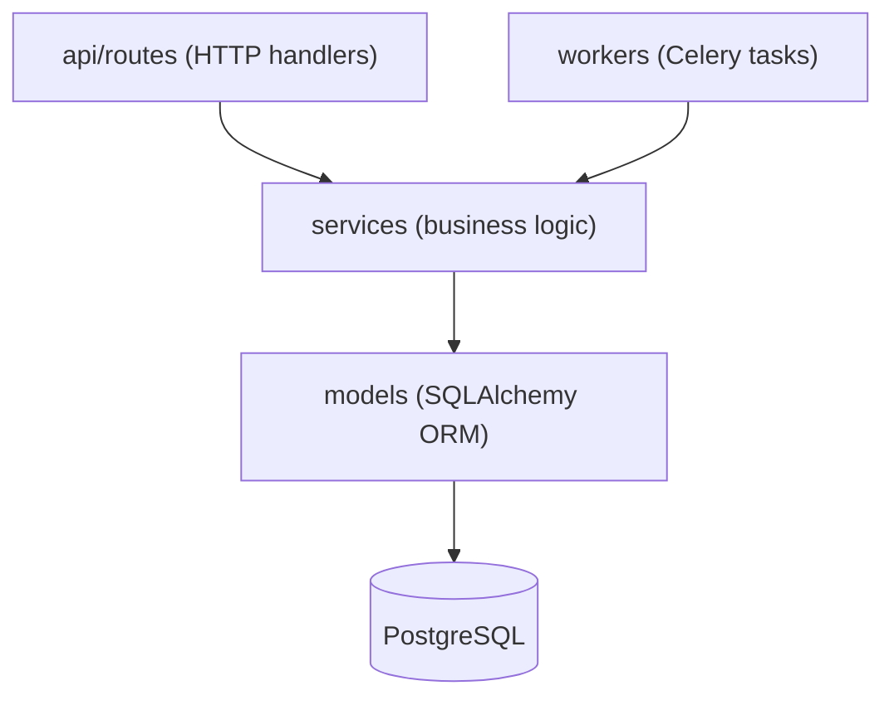
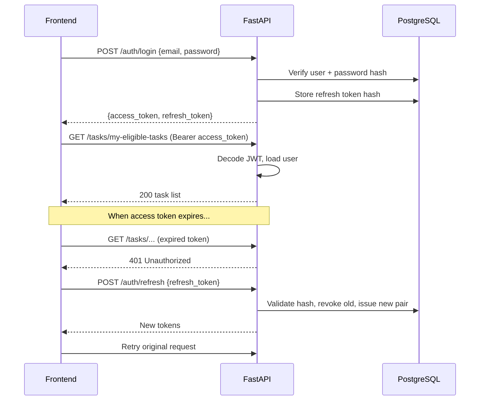
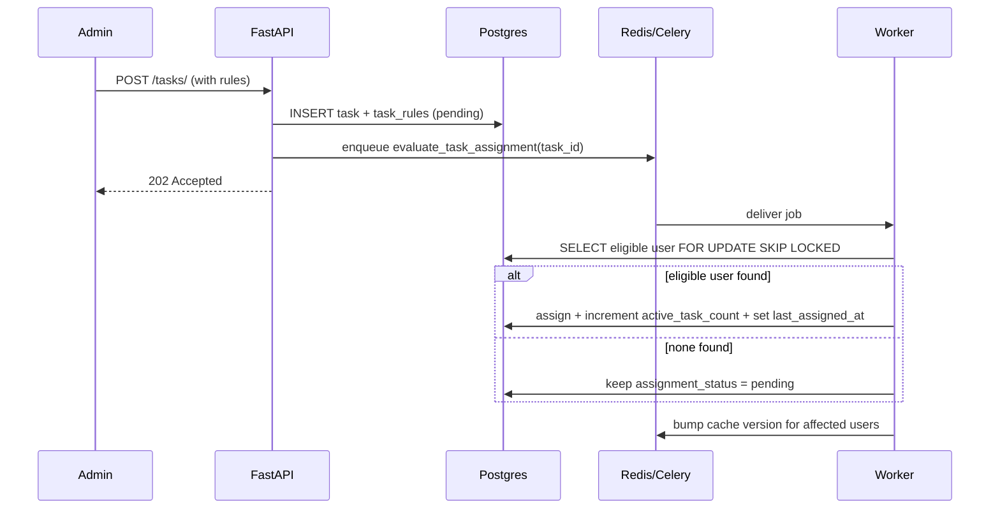
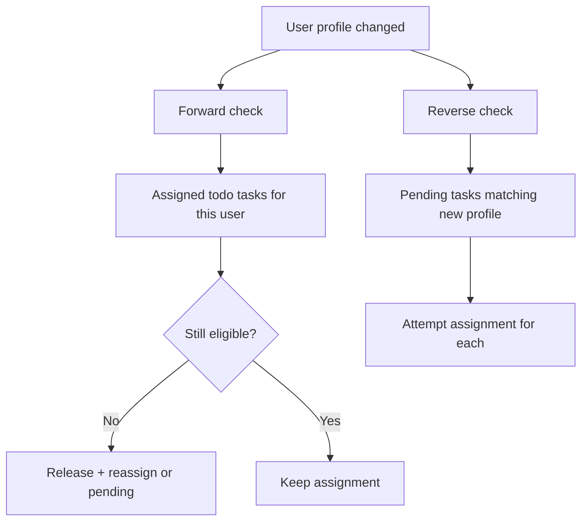
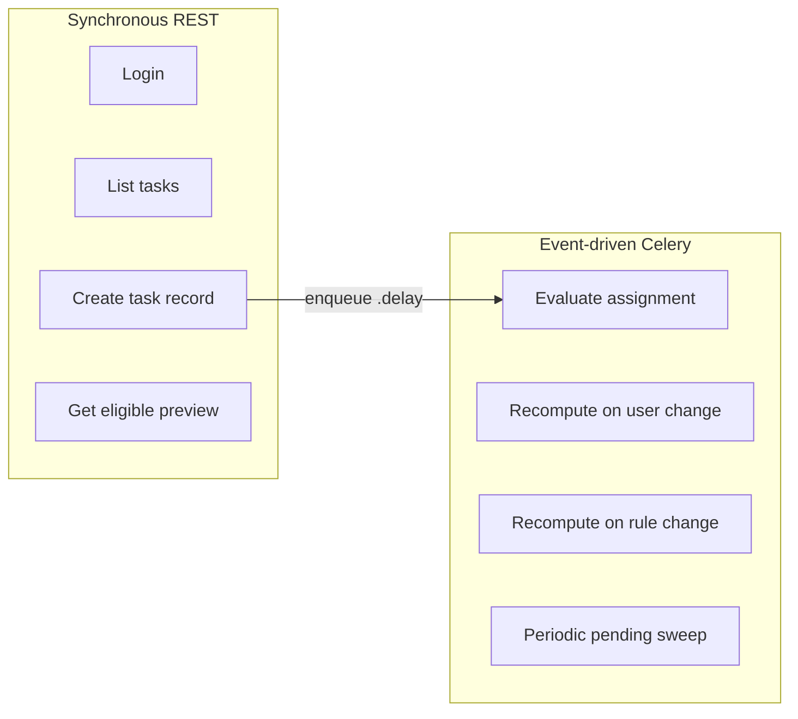

# Task Management System — Technical Documentation

**Dynamic Rule-Based Task Assignment Platform**

Version: 1.0  
Stack: FastAPI · PostgreSQL · Redis · Celery · React

---

## Table of Contents

1. [Executive Summary](#1-executive-summary)
2. [System Overview](#2-system-overview)
3. [Architecture Decisions](#3-architecture-decisions)
4. [High-Level Design (HLD)](#4-high-level-design-hld)
5. [Low-Level Design (LLD)](#5-low-level-design-lld)
6. [Module Breakdown](#6-module-breakdown)
7. [Authentication & Authorization](#7-authentication--authorization)
8. [Rule Engine Design](#8-rule-engine-design)
9. [Recompute Strategy](#9-recompute-strategy)
10. [Indexing Strategy](#10-indexing-strategy)
11. [Caching Strategy](#11-caching-strategy)
12. [Event-Driven Processing (Celery)](#12-event-driven-processing-celery)
13. [API Documentation](#13-api-documentation)
14. [Scenario & Policy Tables](#14-scenario--policy-tables)
15. [Scaling to Production](#15-scaling-to-production)
16. [Failure Handling](#16-failure-handling)
17. [Technology Choices FAQ](#17-technology-choices-faq)
18. [Quick Start](#18-quick-start)

---

## 1. Executive Summary

This system is a **Task Management platform** where tasks are **never manually assigned**. Instead, each task carries a set of **eligibility rules** (department, experience, location, workload limit). A background **rule engine** automatically selects the best matching user and assigns the task.

The platform is designed for scale targets of **100,000 users**, **1,000,000 tasks**, and API response times **under 200 ms** on hot read paths.

Key capabilities:

- Role-based access (Admin, Manager, User)
- JWT authentication with rotating refresh tokens
- Dynamic, per-task rule-based assignment
- Automatic re-evaluation when user profiles or rules change
- Redis-backed caching for performance-critical endpoints
- Celery-based asynchronous assignment and recompute jobs

---

## 2. System Overview

### 2.1 Interaction model

| Layer | Pattern | Description |
|---|---|---|
| Frontend → Backend | **Synchronous REST** | Standard HTTP JSON APIs (Axios client) |
| Backend internal work | **Event-driven async** | Celery workers consume jobs from Redis broker |
| Backend → Database | **Transactional SQL** | PostgreSQL with indexed queries and row locking |
| Backend → Redis | **Cache-aside** | Read-through cache with version-based invalidation |

The API responds quickly to the client. Heavy work (assignment, recompute, sweep) happens **off the request path** in background workers.

### 2.2 Core business flow



---

## 3. Architecture Decisions

| Decision | Choice | Rationale |
|---|---|---|
| Rule storage | Structured columns on `task_rules` (not JSONB/EAV) | Fixed attribute set enables composite/partial indexes; assignment query compiles to indexed SQL |
| Assignment model | Async via Celery | Keeps `POST /tasks/` fast; decouples API latency from rule-engine cost |
| Tie-break among equals | Least-recently-assigned (`last_assigned_at`) | Fair rotation among equally loaded users; `NULL` = never assigned gets priority |
| No eligible users | `assignment_status = pending` (not an error) | Retried automatically on data changes + periodic sweep |
| In-progress tasks | Lock once started | Tasks in `in_progress` or `done` are never reassigned due to profile/rule changes |
| Recompute scope | Event-driven, bounded | Never full-table scan; only affected task/user subsets |
| Cache invalidation | Version counter (`INCR`) | O(1) invalidation without Redis key-pattern deletes |
| Message broker | Redis (via Celery) | Simpler ops for MVP/medium scale; sufficient for assignment workloads |
| Concurrency safety | `FOR UPDATE SKIP LOCKED` | Prevents double-assignment under parallel workers |

---

## 4. High-Level Design (HLD)



### Component responsibilities

| Component | Responsibility |
|---|---|
| **React SPA** | Login, task creation, my-tasks view, admin dashboards |
| **FastAPI** | REST APIs, auth, validation, enqueue background jobs |
| **PostgreSQL** | Users, tasks, rules, refresh tokens; transactional assignment |
| **Redis (DB 0)** | Response cache (cache-aside) |
| **Redis (DB 1–2)** | Celery broker and result backend |
| **Celery Workers** | Assignment, recompute, periodic sweep |
| **Celery Beat** | Schedules `sweep_pending_tasks` every 5 minutes |

---

## 5. Low-Level Design (LLD)

### 5.1 Layered backend structure



| Layer | Location | Responsibility |
|---|---|---|
| Routes | `backend/app/api/routes/` | HTTP endpoints, auth dependencies, request validation |
| Services | `backend/app/services/` | Rule engine, cache helpers |
| Workers | `backend/app/workers/` | Async job wrappers calling services |
| Models | `backend/app/models/` | ORM entities and indexes |
| Schemas | `backend/app/schemas/` | Pydantic request/response DTOs |

### 5.2 Data model (core entities)

```
users
  id, email, password_hash, full_name, role
  department, experience_years, location
  active_task_count          -- denormalized load counter
  last_assigned_at           -- tie-break timestamp
  is_active, created_at, updated_at

tasks
  id, title, description, status, priority, due_date
  created_by, assigned_to
  assignment_status          -- pending | assigned | unassignable
  rules_version              -- cache-busting counter for eligible-users preview
  created_at, updated_at

task_rules (1:1 with tasks)
  task_id (PK/FK)
  department, min_experience_years, location, max_active_tasks
  (NULL on any column = unconstrained)

refresh_tokens
  id, user_id, token_hash, expires_at, revoked_at
```

---

## 6. Module Breakdown

| Module | Path | Purpose |
|---|---|---|
| App entry | `backend/app/main.py` | FastAPI app, CORS, router registration |
| Config | `backend/app/core/config.py` | Environment settings (DB, Redis, JWT, TTLs) |
| Security | `backend/app/core/security.py` | Password hashing, JWT create/decode, refresh token helpers |
| Celery app | `backend/app/core/celery_app.py` | Broker config, queue routing, Beat schedule |
| Cache client | `backend/app/core/cache.py` | Async + sync Redis clients |
| Auth routes | `backend/app/api/routes/auth.py` | Signup, login, refresh |
| Task routes | `backend/app/api/routes/tasks.py` | Task CRUD, eligibility APIs, recompute trigger |
| User routes | `backend/app/api/routes/users.py` | Profile read/update |
| Rule engine | `backend/app/services/rule_engine.py` | Eligibility query, assignment, locking |
| Cache service | `backend/app/services/cache_service.py` | Cache keys, version invalidation |
| Celery tasks | `backend/app/workers/celery_tasks.py` | Assignment, recompute, sweep jobs |
| Frontend API | `frontend/src/api/client.js` | Axios client, token injection, auto-refresh |
| Frontend pages | `frontend/src/pages/` | Login, my tasks, admin task management |

---

## 7. Authentication & Authorization

### 7.1 Authentication flow



### 7.2 Token strategy

| Token | Lifetime | Storage | Purpose |
|---|---|---|---|
| Access token (JWT) | 15 minutes | Client memory/localStorage | Stateless API authentication |
| Refresh token | 7 days | Hashed in `refresh_tokens` table | Obtain new access token; rotated on each use |

### 7.3 Role-based authorization

| Role | Permissions |
|---|---|
| **Admin** | Manage users, create/edit/delete tasks and rules, trigger recompute, view all data |
| **Manager** | Create/edit/delete tasks and rules, trigger recompute, view all tasks |
| **User** | View own assigned tasks (`GET /my-eligible-tasks`), advance status on own tasks only |

Authorization is enforced via FastAPI dependency injection (`require_admin`, `require_admin_or_manager`, `get_current_user`).

---

## 8. Rule Engine Design

### 8.1 Rule attributes

Each task can define zero or more constraints. A `NULL` value means **unconstrained** for that attribute.

| Rule field | Type | Example | Meaning |
|---|---|---|---|
| `department` | enum | `finance` | Only Finance users eligible |
| `min_experience_years` | int | `4` | User must have ≥ 4 years experience |
| `location` | string | `Bengaluru` | User must be in Bengaluru |
| `max_active_tasks` | int | `5` | User's current load must be < 5 |

### 8.2 Assignment algorithm

```sql
SELECT id, active_task_count, last_assigned_at
FROM users
WHERE is_active = true
  AND (department = :dept OR :dept IS NULL)
  AND (experience_years >= :min_exp OR :min_exp IS NULL)
  AND (location = :loc OR :loc IS NULL)
  AND (active_task_count < :max_active OR :max_active IS NULL)
ORDER BY active_task_count ASC,
         last_assigned_at ASC NULLS FIRST,
         id ASC
LIMIT 1
FOR UPDATE SKIP LOCKED;
```

**Selection priority:**

1. **Lowest `active_task_count`** — load balancing
2. **Least recently assigned** — fair rotation among equals (`NULL` = never assigned, highest priority)
3. **`id` ascending** — deterministic final tie-break

On successful assignment:
- `users.active_task_count += 1`
- `users.last_assigned_at = now()`
- `tasks.assigned_to = user.id`
- `tasks.assignment_status = 'assigned'`

### 8.3 Lock-once-started policy

| Task status | Reassign on user/rule change? |
|---|---|
| `todo` | Yes — re-evaluated; may be reassigned if no longer eligible |
| `in_progress` | **No** — locked to current assignee |
| `done` | **No** — locked; capacity released via `active_task_count` decrement |

### 8.4 Assignment sequence diagram



---

## 9. Recompute Strategy

Recompute is **event-driven and bounded** — never a full-table scan over 1M tasks.

### 9.1 Triggers and actions

| Event | Trigger | Celery job | Scope |
|---|---|---|---|
| Task created | `POST /tasks/` | `evaluate_task_assignment(task_id)` | Single task |
| Task rules changed | `PATCH /tasks/{id}` (rules) | `recompute_for_task_rule_change(task_id)` | Single task |
| User profile changed | `PATCH /users/{id}` (dept/exp/location) | `recompute_for_user_change(user_id)` | User's assigned + matching pending tasks |
| Manual admin trigger | `POST /tasks/recompute-eligibility` | Same jobs as above | Specified task or user |
| Periodic safety net | Celery Beat (every 5 min) | `sweep_pending_tasks()` | All `pending` tasks only |

### 9.2 User-change recompute (two bounded lookups)



**Forward check:** only `todo` tasks assigned to the user (in_progress/done are locked).  
**Reverse check:** only `pending` tasks (small subset via partial index).

### 9.3 Task completion

When a user marks a task `done`:
- `users.active_task_count` is decremented
- This frees capacity for **future** assignments (not retroactive)

---

## 10. Indexing Strategy

Indexes are chosen to match the **exact query shapes** of the rule engine and hot read APIs.

| Index | Table | Columns | Type | Purpose |
|---|---|---|---|---|
| `ix_users_email` | `users` | `email` | UNIQUE | Login lookup |
| `ix_users_dept_exp_active_lra` | `users` | `department, experience_years, active_task_count, last_assigned_at` | Partial (`is_active = true`) | Core assignment query: filter + sort in one scan |
| `ix_tasks_assigned_to_status` | `tasks` | `assigned_to, status` | B-tree | `GET /my-eligible-tasks` |
| `ix_tasks_assignment_status_pending` | `tasks` | `assignment_status` | Partial (`= 'pending'`) | Sweep + reverse recompute (bounded to small pending set) |
| `ix_task_rules_department_experience` | `task_rules` | `department, min_experience_years` | B-tree | Join filter for pending-task reverse lookup |
| `ix_tasks_due_date` | `tasks` | `due_date` | B-tree | Admin listing/filtering |
| `ix_tasks_priority` | `tasks` | `priority` | B-tree | Admin listing/filtering |
| `ix_tasks_created_by` | `tasks` | `created_by` | B-tree | Admin listing/filtering |

**Why structured rules (not JSONB)?**  
A generic JSON rule blob would require a GIN index or full scan. Structured nullable columns allow composite B-tree indexes that support both filtering and `ORDER BY` for tie-break — critical at 100k users.

---

## 11. Caching Strategy

Pattern: **cache-aside** via Redis (logical DB 0).

### 11.1 Cached endpoints

| Endpoint | Cache key pattern | TTL | Invalidation |
|---|---|---|---|
| `GET /my-eligible-tasks` | `my_tasks:{user_id}:v{version}:c{cursor}` | 45s | Bump `my_tasks_version:{user_id}` |
| `GET /tasks/{id}/eligible-users` | `eligible_preview:{task_id}:v{rules_version}` | 60s | Auto via `rules_version` increment on rule edit |

Redis DB separation (from `docker-compose.yml`):
- DB 0: response cache
- DB 1: Celery broker
- DB 2: Celery result backend

### 11.2 What is `cursor` in pagination?

`cursor` is a **pagination token** — the last task `id` from the previous page.

| Request | Query | Cache key |
|---|---|---|
| First page | `GET /my-eligible-tasks` | `my_tasks:3:v1:c0` |
| Second page | `GET /my-eligible-tasks?cursor=20` | `my_tasks:3:v1:c20` |

DB query: `WHERE assigned_to = :user_id AND id > :cursor ORDER BY id LIMIT 21`.

Response includes `next_cursor` (last item's id) for the client to fetch the next page.

### 11.3 Version-based invalidation — worked example

**Setup:** User id = 3, version counter = 1.

| Step | Action | Redis state |
|---|---|---|
| 1 | User loads page 1 | `my_tasks_version:3 = 1`; cache `my_tasks:3:v1:c0 = {items: [...]}` |
| 2 | User loads page 2 (`cursor=20`) | cache `my_tasks:3:v1:c20 = {items: [...]}` |
| 3 | Worker assigns new task to user 3 | `INCR my_tasks_version:3` → version becomes **2** |
| 4 | User refreshes page 1 | Reads version=2 → key `my_tasks:3:v2:c0` → **cache miss** → DB query → fresh data cached |

Old `v1` keys are never deleted; they simply become unreachable because all new reads use `v2`. This is **O(1) invalidation** vs expensive `SCAN + DEL` on key patterns.

---

## 12. Event-Driven Processing (Celery)

### 12.1 What Celery does in this project

Celery is the **background job runner**. The API enqueues work; workers execute it asynchronously.

| Celery task | Queue | Trigger | What it does |
|---|---|---|---|
| `evaluate_task_assignment` | `assignment` | Task created | Run rule engine for one task |
| `recompute_for_task_rule_change` | `assignment` | Rules edited | Re-validate and reassign one task |
| `recompute_for_user_change` | `assignment` | User profile changed | Forward + reverse bounded recompute |
| `sweep_pending_tasks` | `sweep` | Celery Beat (5 min) | Retry all pending tasks |

### 12.2 REST vs event-driven — when each is used



The client always uses REST. Celery handles **post-commit side effects** that must not block the HTTP response.

### 12.3 Queue separation

| Queue | Priority | Workload |
|---|---|---|
| `assignment` | High | Real-time assignment and recompute |
| `sweep` | Low | Periodic batch over pending subset |

This prevents a large sweep job from delaying urgent assignment work.

---

## 13. API Documentation

Base URL: `http://localhost:8000/api/v1`  
Interactive docs: `http://localhost:8000/docs`

All protected endpoints require header:
```
Authorization: Bearer <access_token>
```

---

### 13.1 Auth

#### POST `/auth/signup`

**Request:**
```json
{
  "email": "user@example.com",
  "password": "password123",
  "full_name": "Jane Doe",
  "department": "finance",
  "experience_years": 5,
  "location": "Mumbai",
  "role": "user"
}
```

**Response (201):**
```json
{
  "id": 42,
  "email": "user@example.com",
  "full_name": "Jane Doe",
  "role": "user",
  "department": "finance",
  "experience_years": 5,
  "location": "Mumbai",
  "active_task_count": 0,
  "is_active": true,
  "created_at": "2026-08-19T10:00:00Z"
}
```

#### POST `/auth/login`

**Request:**
```json
{
  "email": "admin@example.com",
  "password": "admin123"
}
```

**Response (200):**
```json
{
  "access_token": "eyJhbGciOiJIUzI1NiIs...",
  "refresh_token": "dGhpcyBpcyBhIHJlZnJl...",
  "token_type": "bearer"
}
```

#### POST `/auth/refresh`

**Request:**
```json
{
  "refresh_token": "dGhpcyBpcyBhIHJlZnJl..."
}
```

**Response (200):** Same shape as login (new token pair; old refresh token revoked).

---

### 13.2 Users

#### GET `/users/me`

**Response (200):**
```json
{
  "id": 3,
  "email": "user1@example.com",
  "full_name": "Demo User 1",
  "role": "user",
  "department": "finance",
  "experience_years": 5,
  "location": "Bengaluru",
  "active_task_count": 1,
  "is_active": true,
  "created_at": "2026-08-19T10:00:00Z"
}
```

#### PATCH `/users/{id}` (Admin only)

**Request:**
```json
{
  "department": "finance",
  "experience_years": 8,
  "location": "Delhi"
}
```

**Side effect:** Enqueues `recompute_for_user_change(user_id)` on Celery `assignment` queue.

---

### 13.3 Tasks

#### POST `/tasks/` (Admin/Manager)

**Request:**
```json
{
  "title": "Reconcile Q3 finance ledger",
  "description": "Cross-check Q3 transactions",
  "priority": "high",
  "due_date": "2026-09-30",
  "rules": {
    "department": "finance",
    "min_experience_years": 4,
    "location": null,
    "max_active_tasks": 5
  }
}
```

**Response (202):**
```json
{
  "id": 10,
  "title": "Reconcile Q3 finance ledger",
  "description": "Cross-check Q3 transactions",
  "status": "todo",
  "priority": "high",
  "due_date": "2026-09-30",
  "created_by": 1,
  "assigned_to": null,
  "assignment_status": "pending",
  "rules_version": 1,
  "created_at": "2026-08-19T10:00:00Z",
  "updated_at": "2026-08-19T10:00:00Z",
  "rule": {
    "department": "finance",
    "min_experience_years": 4,
    "location": null,
    "max_active_tasks": 5
  }
}
```

**Side effect:** Enqueues `evaluate_task_assignment(10)` — assignment completes in background (~500ms).

---

#### GET `/tasks/my-eligible-tasks` (Any authenticated user)

**Request:** `GET /tasks/my-eligible-tasks?cursor=0&limit=20`

**Response (200):**
```json
{
  "items": [
    {
      "id": 1,
      "title": "Reconcile Q3 finance ledger",
      "status": "todo",
      "priority": "high",
      "assigned_to": 3,
      "assignment_status": "assigned",
      "rule": {
        "department": "finance",
        "min_experience_years": 4,
        "location": null,
        "max_active_tasks": 5
      }
    }
  ],
  "next_cursor": null
}
```

---

#### GET `/tasks/{id}/eligible-users` (Admin/Manager)

**Response (200):**
```json
[
  {
    "id": 5,
    "full_name": "Demo User 3",
    "email": "user3@example.com",
    "department": "it",
    "experience_years": 7,
    "location": "Delhi",
    "active_task_count": 0,
    "last_assigned_at": null
  },
  {
    "id": 13,
    "full_name": "Demo User 11",
    "email": "user11@example.com",
    "department": "it",
    "experience_years": 15,
    "location": "Hyderabad",
    "active_task_count": 0,
    "last_assigned_at": "2026-08-18T14:00:00Z"
  }
]
```

---

#### PATCH `/tasks/{id}`

**Admin/Manager — update rules:**
```json
{
  "rules": {
    "department": "finance",
    "min_experience_years": 4,
    "max_active_tasks": 0
  }
}
```

**User — advance status only:**
```json
{
  "status": "in_progress"
}
```

**Side effects:**
- Rule change → `rules_version++`, enqueue `recompute_for_task_rule_change`
- Status → `done` → decrement assignee's `active_task_count`, bump cache version

---

#### POST `/tasks/recompute-eligibility` (Admin/Manager)

**Request (by task):**
```json
{ "task_id": 9 }
```

**Request (by user):**
```json
{ "user_id": 5 }
```

**Response (202):**
```json
{
  "status": "queued",
  "jobs": ["task:9"]
}
```

---

## 14. Scenario & Policy Tables

### 14.1 Assignment scenarios

| # | Scenario | Outcome | `assignment_status` |
|---|---|---|---|
| 1 | One eligible user | Assigned to that user | `assigned` |
| 2 | Multiple eligible users | Least-loaded; tie → least-recently-assigned | `assigned` |
| 3 | No eligible users | Not an error; stays unassigned | `pending` |
| 4 | User at max active tasks | Excluded from candidate pool | others assigned or `pending` |
| 5 | Concurrent workers, overlapping pool | `SKIP LOCKED` prevents double-assign | `assigned` (one winner) |
| 6 | Never-assigned user among equals | `last_assigned_at IS NULL` → preferred | `assigned` |

### 14.2 Recompute & lock scenarios

| # | Scenario | Task status | Action |
|---|---|---|---|
| 1 | User dept changes, task is `todo` | `todo` | Re-evaluate; may reassign |
| 2 | User exp drops below min, task is `todo` | `todo` | Release + reassign or pending |
| 3 | User dept changes, task is `in_progress` | `in_progress` | **Locked — no change** |
| 4 | Rules become stricter, task is `in_progress` | `in_progress` | **Locked — no change** |
| 5 | User profile change unlocks pending task | `pending` | Attempt assignment |
| 6 | Task marked `done` | `done` | Decrement load; locked forever |
| 7 | New user signs up matching old pending rules | `pending` | Caught by sweep or user-triggered recompute |

### 14.3 Tie-break example

Three Finance users, all with `active_task_count = 2`:

| User | active_task_count | last_assigned_at | Selected? |
|---|---|---|---|
| U10 | 2 | 2026-08-19 09:00 | No |
| U15 | 2 | 2026-08-19 08:00 | **Yes** (assigned longest ago) |
| U20 | 2 | NULL | **Yes over U10/U15** if NULLS FIRST (never assigned) |

---

## 15. Scaling to Production

**Yes — this architecture can scale to large production.** It is stateless at the API layer and uses proven horizontal-scaling patterns.

### 15.1 Scaling dimensions

| Component | Scale strategy |
|---|---|
| FastAPI | Horizontal pod autoscaling behind load balancer |
| Celery workers | Scale `assignment` and `sweep` queues independently |
| PostgreSQL | Read replicas, PgBouncer connection pooling, partition `tasks` at very high volume |
| Redis | Sentinel/Cluster for HA; separate cache and broker instances at scale |

### 15.2 What already supports scale

- Stateless JWT auth (no server-side session store)
- Async I/O (FastAPI + asyncpg)
- Index-driven queries (no full-table scans on hot paths)
- Partial indexes on `pending` subset
- Cache-aside on two performance-critical endpoints
- Queue separation (assignment vs sweep)
- Row-level locking for safe concurrent assignment

### 15.3 Production hardening checklist

- [ ] Restrict CORS to known origins
- [ ] Secrets from vault/KMS (not env defaults)
- [ ] TLS termination at load balancer
- [ ] Metrics: queue depth, assignment latency, cache hit rate, pending-task age
- [ ] Dead-letter queue for permanently failing Celery jobs
- [ ] Database backups and failover
- [ ] Rate limiting on auth endpoints

---

## 16. Failure Handling

| Failure | User impact | System behavior | Recovery |
|---|---|---|---|
| FastAPI instance crash | Request fails on that instance | LB routes to healthy instances | Auto-restart / K8s reschedule |
| Redis unavailable | Cache miss + queue down | Reads fall back to DB (slower); writes can't enqueue | Redis HA failover |
| Celery worker down | Assignment delayed | Jobs accumulate in Redis queue | Scale/restart workers; jobs processed on recovery |
| Celery Beat down | Periodic sweep stops | Event-driven recompute still works | Restart Beat |
| PostgreSQL down | Full outage | API and workers fail DB operations | HA Postgres failover |
| Single job failure | One task assignment delayed | Retry up to 3 times (5s delay) | Manual recompute via API |
| Access token expired | 401 on request | Frontend auto-refreshes via `/auth/refresh` | Transparent to user |
| Refresh token expired/revoked | Forced re-login | Frontend redirects to login page | User re-authenticates |

---

## 17. Technology Choices FAQ

### Why Redis and not RabbitMQ for Celery?

| | Redis broker | RabbitMQ |
|---|---|---|
| Ops complexity | Lower (already used for cache) | Additional service to operate |
| Throughput | High for short tasks | Excellent for complex routing |
| Durability | Good (AOF/RDB persistence) | Stronger message guarantees |
| Best for | MVP → medium scale assignment queues | Enterprise queue semantics, DLQ, routing |

**This project uses Redis** because assignment jobs are short, idempotent, and the infra footprint stays minimal. RabbitMQ is a natural upgrade if you need stronger delivery guarantees or complex routing.

### Why not Kafka?

Kafka excels at **event streaming** (high-throughput logs, replay, analytics pipelines).  
This system's background work is **task-queue semantics** (pick up a job, process it, ack). Celery + Redis/RabbitMQ is the right tool class. Kafka would add operational overhead without clear benefit unless you also need event sourcing or cross-service streaming.

### Is "RedisMQ" used?

There is no separate product called "RedisMQ" in this project. **Redis serves as the Celery message broker** (queue transport). Celery publishes job messages to Redis; workers consume them.

### Can we switch broker later?

Yes. Celery supports RabbitMQ, Redis, SQS, and others. Changing `CELERY_BROKER_URL` and worker config is sufficient — the task code (`evaluate_task_assignment`, etc.) stays the same.

---

## 18. Quick Start

```bash
# Start all services
docker compose up --build

# Seed demo data (run once)
docker compose exec backend python -m app.seed.seed_data

# Run migrations manually (if needed)
docker compose exec backend alembic upgrade head
```

| Service | URL |
|---|---|
| Frontend | http://localhost:5173 |
| API docs (Swagger) | http://localhost:8000/docs |
| Health check | http://localhost:8000/health |

**Demo accounts (after seed):**

| Email | Password | Role |
|---|---|---|
| admin@example.com | admin123 | Admin |
| manager@example.com | manager123 | Manager |
| user1@example.com | password123 | User |

---

*For the original architecture design rationale, see also [ARCHITECTURE.md](ARCHITECTURE.md).*
